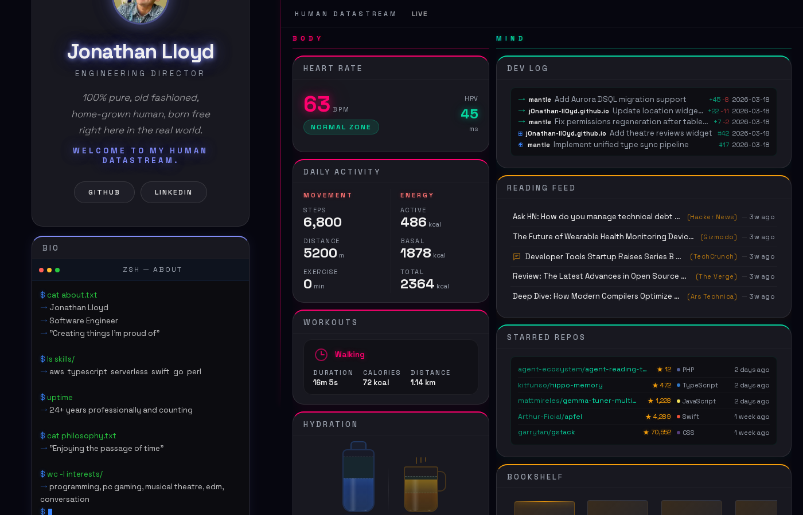

# Human Datastream

A personal portfolio dashboard for Jonathan Lloyd, styled as a sci-fi "Human Datastream" -- a read-only display surface that renders real personal data (health, activity, GitHub, reading, location) as a live, glass-morphism dashboard. Built with [Astro 6](https://astro.build) and deployed to Cloudflare Pages at [jonathanlloyd.me](https://jonathanlloyd.me).

[](https://github.com/j0nathan-ll0yd/j0nathan-ll0yd.github.io/actions/workflows/deploy.yml)



## Quick Start

```bash
npm install            # add --legacy-peer-deps if the peer-dep gate fails
npm run dev            # dev server at http://localhost:4321
npm run build          # production build into dist/
npm run preview        # preview the production build
```

All UI widgets are imported from the Design System package (`@j0nathan-ll0yd/web/production`), published to GitHub Packages; this repo contains no widget source. `npm ci --legacy-peer-deps` resolves the `@j0nathan-ll0yd/*` packages from the registry (`@j0nathan-ll0yd:registry=https://npm.pkg.github.com` in `.npmrc`, authenticated by `GITHUB_TOKEN` in CI or a PAT in `~/.npmrc` locally).

## Architecture

Astro renders static HTML at build time from local JSON fixtures, then hydrates client-side from CloudFront. The Design System owns all widgets, tokens, and runtime scripts; this repo owns only page composition, layout, and the data-loading shell.

```
data/*.json ──► index.astro (build time) ──► static HTML ──► Cloudflare Pages
                                                  │
                                  client hydration │ runtime polling
                                                  ▼
                          CloudFront JSON ──► @j0nathan-ll0yd/web/runtime/live-data
```

- **Astro 6 static output** -- 0 KB JS by default; interactivity via selective islands.
- **Design System** (`@j0nathan-ll0yd/web`, `@j0nathan-ll0yd/tokens`, `@j0nathan-ll0yd/schemas`) -- published from `design-system-Lifegames` to GitHub Packages; source of all widgets, CSS tokens, and fixture schemas.
- **CloudFront data layer** -- live data fetched after page load; polled (30s fast / 120s slow) with WebSocket fallback.

## Testing

```bash
npm run test:build               # Vitest build-output tests (SEO, JSON-LD, images)
npm run test:visual              # Playwright visual regression in Docker (arm64-native, CI-parity)
npm run test:visual:update       # regenerate baselines in Docker (only sanctioned path)
```

- **Build tests** ([Vitest](https://vitest.dev)) assert SEO metadata, JSON-LD, and image integrity against `dist/`.
- **Visual regression** ([Playwright](https://playwright.dev)) screenshots the dashboard at 4 viewports. Baselines are byte-stable only when generated inside the CI-matching Linux/AMD64 Docker container -- a runtime guard refuses host-side `--update-snapshots`. Add the `update-snapshots` PR label to regenerate baselines in CI.
- **Production smoke check** runs `npm run test:smoke` on a native `ubuntu-latest` runner against the live `jonathanlloyd.me` after each deploy (`.github/workflows/smoke-check.yml`). It asserts the site actually hydrated -- widget containers present, `.is-loading` skeletons cleared, bio terminal typed, service worker registered, no CSP or console errors -- and files a `smoke-failure` issue on regression. No baselines, nothing to regenerate. It replaced the retired pixel-drift suite, which could not stay green against a live data stream and could not catch a blocked-hydration failure.

## Data Pipeline

Two data paths feed the dashboard:

- **Build-time** -- `src/lib/load-dashboard-data.ts` returns the DS-owned SSR shell from `@j0nathan-ll0yd/fixtures` (`getDashboardFixture()`). Fixtures are no longer hand-baked in this repo; the single source of truth is `design-system-Lifegames/packages/fixtures`. `import.meta.env.FIXTURE_VARIATION` (wired in `astro.config.mjs`) selects a named variation; default is `baseline`.
- **Runtime** -- the client polls CloudFront JSON endpoints via `@j0nathan-ll0yd/web/runtime/live-data` for live values once the page loads.

Consumer-side fixtures are forbidden (Invariant I2, enforced by `npm run audit:fixtures` in the prebuild gate). Visual tests render reproducible snapshots by intercepting the CloudFront endpoints and serving raw fixtures from `@j0nathan-ll0yd/fixtures/generated/<domain>/<variation>.json`.

## Deploy

Push to `main` triggers GitHub Actions (`.github/workflows/deploy.yml`): `npm run build` then `cloudflare/wrangler-action@v4` deploys `dist/` to the `human-datastream` Cloudflare Pages project. No manual deploy step.

## Documentation

- [`AGENTS.md`](AGENTS.md) -- canonical agent contract: commands, conventions, and do/don't rules (read this before editing).
- [`CLAUDE.md`](CLAUDE.md) -- Claude Code-specific extras (imports `AGENTS.md`).
- [`docs/wiki/`](docs/wiki/Home.md) -- deeper reference: [Astro Implementation](docs/wiki/Astro-Implementation.md), [Brand Guide](docs/wiki/Brand-Guide.md), [Why Astro](docs/wiki/Why-Astro.md), [LLM Content Spec](docs/wiki/LLM-Content-Spec.md), [Scripts Reference](docs/wiki/Scripts-Reference.md).
- [`docs/visual-regression-testing.md`](docs/visual-regression-testing.md) -- visual-baseline guard rationale.
- `docs/onboarding-review/` -- active architectural plans and roadmap (local working set; see the team thoughts repo).

## Tech Stack

Astro 6, Vitest, Playwright, Ajv, wrangler (Cloudflare Pages), `@vite-pwa/astro`, `@astrojs/sitemap`, and pngjs/pixelmatch for screenshot diffing. Visual styling, fonts, and interactive widgets are provided by the Design System (`@j0nathan-ll0yd/*`).
