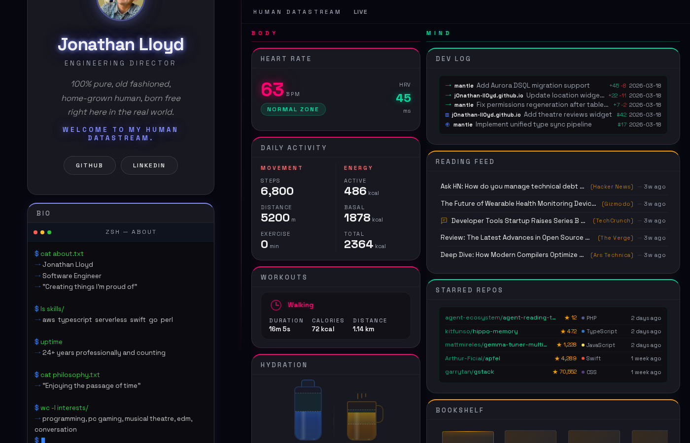

# Human Datastream

A personal portfolio dashboard for Jonathan Lloyd, styled as a sci-fi "Human Datastream" -- a read-only display surface that renders real personal data (health, sleep, workouts, focus, reading, GitHub activity, theatre reviews) as a live, glass-morphism dashboard. Built with [Astro](https://astro.build) 7 and deployed to Cloudflare Pages at [jonathanlloyd.me](https://jonathanlloyd.me).

> **WARNING: merging to `main` deploys production.** No manual gate, no staging environment, no promotion step. See [Deploy](#deploy).

[](https://github.com/j0nathan-ll0yd/j0nathan-ll0yd.github.io/actions/workflows/deploy.yml)



## Quick Start

This repository is pnpm-only. `package.json` pins `pnpm@11.22.0` through `packageManager`; Node comes from `.nvmrc`. Never run `npm` or `yarn` here -- either one writes a foreign lockfile and shunts the `@j0nathan-ll0yd/*` packages aside.

```bash
pnpm install           # install dependencies
pnpm dev               # dev server at http://localhost:4321
pnpm build             # production build into dist/
pnpm preview           # preview the production build
```

All UI widgets come from the Design System package (`@j0nathan-ll0yd/web/production`), published to GitHub Packages; this repository contains no widget source. The committed `.npmrc` maps the `@j0nathan-ll0yd` scope to `https://npm.pkg.github.com` and carries no auth token: local installs read it from your machine-global `~/.npmrc`, and each installing workflow writes it at the user level with `pnpm config set`.

`.husky/pre-push` gates every push -- `doctor:install`, `format:check`, `typecheck`, `lint`, then the visual suite in Docker.

## Architecture

Astro renders a data-free static page at build time: authored identity copy plus every live widget in its honest `loading` state. The client then fills live data from CloudFront.

```text
@j0nathan-ll0yd/copy ──► index.astro (build time) ──► static HTML ──► Cloudflare Pages
                                                  │
                                  client hydration │ runtime polling
                                                  ▼
                              CloudFront JSON ──► src/lib/runtime/live-data.ts
```

- **Astro static output** (`output: 'static'` in `astro.config.mjs`) -- no JavaScript by default; interactivity arrives through selective islands.
- **Design System** (`@j0nathan-ll0yd/web`, `@j0nathan-ll0yd/tokens`, `@j0nathan-ll0yd/schemas`) -- published from `design-system-Lifegames`. It owns every widget, CSS token and fixture schema, plus the shared browser helpers under `@j0nathan-ll0yd/web/runtime/*` (adapters, updaters, particles, input modality).
- **Client data runtime** -- app-local under `src/lib/runtime/`, **not** in the Design System package. `src/pages/index.astro` pulls it in as `import '../lib/runtime/live-data'`. That module drives the poll engine, the CloudFront fetch layer and the WebSocket client. `scripts/check-live-data-bundle.mjs` runs in `postbuild` and fails the build if Rollup tree-shakes the side-effect-only import away. `src/lib/mobile-bg.ts` is app-local for the same reason.
- **CloudFront data layer** -- the client polls after page load on two tiers: fast at 30s, slow at 120s. Once the WebSocket connects, the engine drops to its passive tiers (120s and 300s) and the WebSocket push becomes the authoritative focus-state source.

## Edge Functions

`functions/` holds the Cloudflare Pages Functions that run at the edge in production:

- **LLM content proxies** -- `/llms.txt`, `/llms-full.txt` and `/index.md` proxy the canonical artifacts from the LifegamesPortal CloudFront origin, which owns the content. `functions/_lib/` holds the shared proxy factory and the artifact paths.
- **Feed endpoints** -- `/feed.json` and `/feed.xml` proxy the backend-owned JSON Feed and RSS with edge caching.
- **Response headers** -- `functions/_middleware.ts` exports the CSP and applies the header policy to Function responses; `public/_headers` covers static assets only, so a policy change must touch both. `/api/csp-report` collects violation reports.
- **First-party analytics proxies** -- `/sa` and `/simple/*` front Simple Analytics; `/cf-insights.js` and `/cf-rum` front Cloudflare Web Analytics. Each keeps the request same-origin, so Safari tracking protection never sees a third-party host.

## Testing

```bash
pnpm test                 # unit + build-output tests
pnpm run test:build       # Vitest build-output tests (SEO, JSON-LD, images)
pnpm run test:visual      # Playwright visual regression in Docker (arm64-native, CI-parity)
pnpm run test:behavioral  # Playwright behavioral and a11y suite in Docker
```

- **Build tests** ([Vitest](https://vitest.dev)) assert SEO metadata, JSON-LD, image integrity and the data-free `/` (no fixture value, every live card `loading`, identity copy present) against `dist/`.
- **Visual regression** ([Playwright](https://playwright.dev)) screenshots the dashboard across the viewport matrix in `playwright.config.ts`. Baselines stay byte-stable only when generated inside the `linux/arm64` Docker image the CI runner is built from, so a runtime guard refuses host-side `--update-snapshots`. To regenerate in CI, dispatch `.github/workflows/visual-tests.yml` with the `update_snapshots` input.
- **Production smoke check** runs `pnpm run test:smoke` against the live site after each deploy (`.github/workflows/smoke-check.yml`). It asserts the site hydrated -- widget containers present, `.is-loading` skeletons cleared, bio terminal typed, service worker registered, no CSP or console errors. On regression it files a `smoke-failure` issue rather than failing the run.
- **CI runs on self-hosted runners only.** Every `runs-on` in `.github/workflows/` targets the self-hosted `linux, arm64` fleet from `ci-runners-private`. No job uses a GitHub-hosted runner.

## Data Pipeline

Two data paths feed the dashboard:

- **Build-time** -- `src/lib/load-dashboard-data.ts` returns no data (atlas decision 0160, PR 0a). The page carries only authored identity content from `@j0nathan-ll0yd/copy` (`src/lib/identity-profile.ts`). Every live widget renders its `loading` state with a `<noscript>` note, so a client without JavaScript sees no fabricated value.
- **Runtime** -- the client polls the CloudFront JSON endpoints through `src/lib/runtime/live-data.ts` once the page loads.

`@j0nathan-ll0yd/fixtures` is a devDependency for tests only. `pnpm run audit:fixtures` (prebuild) fails on a direct import from `src/` or `functions/` and on consumer-side fixture JSON (Invariant I2). The `forbid-fixtures` Vite plugin fails the production build when any module resolves to the package, directly or transitively. Visual and behavioral tests render reproducible snapshots by intercepting the CloudFront endpoints and serving raw fixtures from `@j0nathan-ll0yd/fixtures/generated/<domain>/<variation>.json`.

## Deploy

> **WARNING: merging a pull request to `main` deploys production immediately.**

`.github/workflows/deploy.yml` fires on every push to `main`. It builds with `pnpm build`, then `cloudflare/wrangler-action@v4` runs `pages deploy dist --project-name=human-datastream`, which serves [jonathanlloyd.me](https://jonathanlloyd.me). No approval step, no staging environment, no promotion. The `Production Smoke Check` workflow runs afterwards against the live site.

Open a pull request to get an isolated preview deployment from `.github/workflows/preview-deploy.yml`. Verify there before you merge.

## Documentation

- [`AGENTS.md`](AGENTS.md) -- canonical agent contract: commands, conventions, and do/do-not rules. Read it before editing.
- [`CLAUDE.md`](CLAUDE.md) -- Claude Code extras; it imports `AGENTS.md`.
- [`docs/wiki/`](docs/wiki/Home.md) -- deeper reference, published to the GitHub wiki by `.github/workflows/sync-wiki.yml`: [Astro Implementation](docs/wiki/Astro-Implementation.md) · [Why Astro](docs/wiki/Why-Astro.md) · [Scripts Reference](docs/wiki/Scripts-Reference.md) · [Widget Specification](docs/wiki/Widget-Specification.md) · [Brand Guide](docs/wiki/Brand-Guide.md) · [Copy Package Spec](docs/wiki/Copy-Package-Spec.md) · [LLM Content Spec](docs/wiki/LLM-Content-Spec.md) · [Feed Spec](docs/wiki/Feed-Spec.md) · [Metadata Files Spec](docs/wiki/Metadata-Files-Spec.md) · [Sources and Acknowledgments](docs/wiki/Sources-and-Acknowledgments.md).
- [`docs/discovery-surface.md`](docs/discovery-surface.md) -- how the site exposes itself to search engines and AI agents.
- [`docs/visual-regression-testing.md`](docs/visual-regression-testing.md) -- visual-baseline guard rationale.

## Tech Stack

Astro 7, Vitest, Playwright, Ajv, wrangler (Cloudflare Pages), `@vite-pwa/astro`, `@astrojs/sitemap`, and pngjs/pixelmatch for screenshot diffing. The Design System (`@j0nathan-ll0yd/*`) supplies visual styling, fonts, and interactive widgets. `package.json` holds the authoritative versions.
